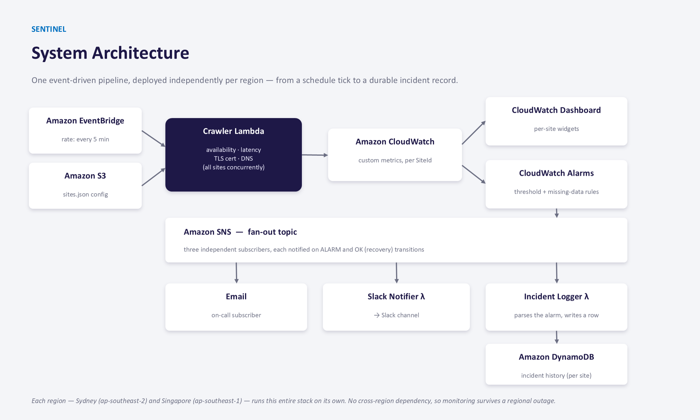

# Sentinel: AWS Website Health Monitoring Platform

Serverless, multi-region website health monitoring platform on AWS. Built with CDK, Lambda, CloudWatch, SNS, and DynamoDB to track availability and latency, alert on failures, and log incidents automatically.

## Project Overview

Sentinel is a serverless monitoring system that periodically checks a configurable list of public websites, records their availability and latency to Amazon CloudWatch, visualizes this data on a live dashboard, and automatically raises alarms and logs incidents when a website's health drops below an acceptable threshold. The entire system is deployed and managed as Infrastructure-as-Code using the AWS Cloud Development Kit (CDK).

This project is being built as the NIT6150 Advanced Project at Victoria University.

## Team

- **Tenzing Tsering Lama** — Team Lead / Lead Developer
- **Samrat Neupane** — Research and Testing
- **Md. Malik** — Research and Testing

## Architecture

Sentinel is deployed as a single CDK stack, instantiated independently per AWS Region. Each regional instance creates its own fully independent set of resources (Lambda, S3, EventBridge, CloudWatch, SNS, DynamoDB) with no cross-region dependencies, so monitoring can continue uninterrupted in one region even if another becomes unavailable.



```
S3 (site list) → Lambda (canary/crawler) → CloudWatch (metrics)
                                                  ├── CloudWatch Dashboard
                                                  └── CloudWatch Alarms → SNS (notify)
                                                                       └── DynamoDB (log)
```

Each regional stack contains:

- **AWS Lambda** — website availability and latency checks
- **Amazon S3** — monitored-site configuration (`sites.json`)
- **Amazon EventBridge** — scheduled monitoring trigger _(planned — Phase 2)_
- **Amazon CloudWatch** — metrics, dashboards, and alarms _(metrics: Phase 2; alarms/dashboard: Phase 2–3)_
- **Amazon SNS** — alert notifications _(planned — Phase 3)_
- **Amazon DynamoDB** — incident records _(planned — Phase 3)_

## AWS Regions

| Region           | Location                                       | Status                                                                  |
| ---------------- | ---------------------------------------------- | ----------------------------------------------------------------------- |
| `ap-southeast-2` | Sydney                                         | Primary deployment region                                               |
| _TBD_            | _TBD (candidate: Singapore, `ap-southeast-1`)_ | Second region, to be finalised during multi-region deployment (Phase 2) |

The same CDK stack definition is deployed to each region independently — regional resources are intentionally isolated so monitoring can continue from one region if another becomes unavailable.

## Project Status

🚧 **In progress** — currently in Phase 2 (crawler and S3 site configuration). See the project proposal and System Analysis and Design Report in `docs/` for the full phased plan.


| Feature | Status |
|---|---|
| Single-site health check (canary) | ✅ Implemented |
| Multi-site crawler (S3-configured) | ✅ Implemented |
| Scheduled execution (EventBridge) | ✅ Implemented |
| CloudWatch metric publishing | ✅ Implemented |
| CloudWatch Dashboard | ✅ Implemented |
| Multi-region deployment | ✅ Implemented |
| CloudWatch Alarms | ✅ Implemented |
| SNS notifications | ✅ Implemented |
| DynamoDB incident logging | ⬜ Not yet implemented |


## Features

### Website monitoring

The crawler Lambda reads the monitored-site list from S3 (`config/sites.json`). For each configured website, it records:

- Availability (up/down)
- HTTP status code
- Response latency (milliseconds)
- Error information when a request fails or times out

### CloudWatch metrics _(planned)_

Custom metrics will be published under the namespace `Sentinel/Monitoring`:

- Availability
- Latency

Metrics will use the website name as a dimension (e.g. `Site = example-site-01`).

### CloudWatch dashboards _(planned)_

Each regional stack will create a regional CloudWatch Dashboard including:

- Website availability
- Website latency
- Lambda invocations, errors, and duration

Dashboard names will follow the pattern `Sentinel-<region>`, e.g. `Sentinel-ap-southeast-2`.

### CloudWatch alarms _(planned)_

Two alarms are planned for Phase 3:

- **Availability alarm** — enters the alarm state when a site's availability falls below the expected value
- **Latency alarm** — triggers when response latency exceeds the configured threshold

Alarm notifications will be connected to an SNS topic.
## SNS Email Notification

Implemented an **SNS notification system** for Sentinel.

- **SNS Topic** → Receives CloudWatch alarm notifications.
- **Email Subscription** → Sends alerts to the configured email.
- **CloudWatch Alarm** → Triggers when website availability falls below `1`.
- **SNS Action** → Connects the CloudWatch alarm to the SNS topic.
- **EC2** → Used as the development environment for implementing the feature.

### Availability

- **Availability = `1`** → The website is **up and reachable**. No alarm is triggered.
- **Availability = `0`** → The website is **down/unreachable**. The CloudWatch alarm is triggered and SNS sends an email notification.

### SNS Flow

```text
Website
   ↓
Crawler Lambda
   ↓
Availability = 1 or 0
   ↓
CloudWatch Metric
   ↓
CloudWatch Alarm
   ↓
SNS Topic
   ↓
Email Notification
```

### DynamoDB incident records _(planned)_

Monitoring incidents will be stored in a regional DynamoDB table, with each record containing:

- Incident ID
- Website name and URL
- Metric type, measured value, and threshold
- Timestamp and alarm state

Each AWS region will have its own incident table.

## Tech Stack

- **AWS CDK** (TypeScript) — Infrastructure as Code
- **AWS Lambda** — serverless compute for the canary/crawler
- **Amazon S3** — monitored-site configuration storage
- **Amazon CloudWatch** — metrics, dashboards, alarms
- **Amazon EventBridge** — scheduled execution
- **Amazon SNS** — alarm notifications
- **Amazon DynamoDB** — incident logging

## Repository Structure

```
sentinel-aws-monitor/
├── bin/                              # CDK app entry point
├── cdk.out/                          # Synthesized CloudFormation templates (generated, git-ignored)
├── config/
│   └── sites.json                    # Monitored-site configuration
├── docs/
│   └── NIT6150_Project_Proposal_Final.docx
├── infra/                            # CDK stack definitions
├── lambda/
│   ├── canary.ts                     # Phase 1: single-site health check
│   ├── crawler.ts                    # Phase 2: multi-site crawler (reads config/sites.json)
│   └── site-config.ts                # Shared types for site configuration
├── node_modules/                     # Installed dependencies (git-ignored)
├── test/                             # Unit tests
├── .gitignore
├── .npmignore
├── cdk.json                          # CDK app configuration
├── jest.config.js                    # Test runner configuration
├── out-crawler.json                  # Sample crawler invoke output
├── package.json
├── package-lock.json
├── README.md
└── tsconfig.json
```

## Prerequisites

- Node.js (LTS)
- AWS CLI, configured with an IAM user (`aws configure`)
- AWS CDK CLI (`npm install -g aws-cdk`)
- An AWS account with permissions for Lambda, S3, CloudWatch, SNS, DynamoDB, EventBridge, and IAM

## Setup

```bash
# Clone the repository
git clone https://github.com/TenzingT-Lama2001/sentinel-aws-monitor.git
cd sentinel-aws-monitor

# Install dependencies
npm install

# Bootstrap CDK (one-time per AWS account/region)
cdk bootstrap

# Synthesize the CloudFormation template (sanity check)
cdk synth

# Deploy the stack
cdk deploy
```

## Sprints
## Sprint 1 

Worked on project proposal. Reviewed the project requirements and explored a lil bit about aws services like Cloudwatch alarms and metrics.

## Sprint 2 
Worked on finalising the system analysis and design report .Updated few details about the project description on the read me file with architecture figures. Setup the project locally in my machine. Added extension in vscode for aws setups.

## Blockers (Sprint 2)

Hit a design decision that hasn't been fully resolved yet: how the dashboard should update when websites are added or removed from the monitoring list. Right now, it only updates on manual redeploy, which works but isn't ideal long term. Looked at more automatic options, but they come with their own downsides, such as leftover resources that don't clean up properly, or the dashboard still showing data for sites already removed. This needs a decision before the dashboard can be considered fully finished.

## Sprint 3 

Configured an ec2 instance where AWS CDK application was built to validate infrastructure changes. Implemented SNS topic and Email subscription for Sentinel Monitoring Alerts. Configured cloud watch availability alarm for monitored website and connected the alarms to SNS so that notifications are automatically sent when the website availability falls below configured alarm threshold.

## Sprint 4 (upcoming)
Initialize Dynamo DB and create a lambda function to record all the incident report in dynamo db permanently. Test the system end to end to make sure every record is stored in dynamo db.

## Sprint 3
Completed multi-region deployment (Sydney + Singapore, both running independently). Set up the CI pipeline (lint, type-check, test, cdk synth on every pull request), CD is still pending, deployment remains manual for now. Added ESLint and Prettier for consistent code style and formatting. Reviewed Samrat's SNS implementation and adjusted the alarm thresholds to match what's documented in the SAD report. Added runtime validation for sites.json so a malformed config fails clearly at synth time instead of causing confusing downstream errors.

Manually tested the full alert pipeline end-to-end, simulated outage, and recovery, and confirmed email notifications fired correctly in every case, including that we only get notified on genuine state changes rather than repeatedly while an issue persists.

## Sprint 4 (Upcoming)
For the next sprint, the plan is to test the incident logging pipeline end-to-end with DynamoDB ,triggering real alarms and confirming incidents get correctly written. I'll also write unit tests for the key Lambda functions to lock in current behavior and catch errors early. Finally, I'll set up the CD pipeline — automated deployment to both regions on merge to main, including the AWS authentication setup (OIDC) needed to let GitHub Actions deploy securely.

## License

This project is submitted as coursework for NIT6150 Advanced Project, Victoria University.
